# Invoice Fulfillment Process

<!-- TOC -->

- [Invoice Fulfillment Process](#invoice-fulfillment-process)
  - [Diagram](#diagram)
  - [Process](#process)
    - [Step 1: Email Submission](#step-1-email-submission)
    - [Step 2: Integrify Review](#step-2-integrify-review)
      - [Step 2.1: Supervisor Review](#step-21-supervisor-review)
      - [Step 2.2: AP Review](#step-22-ap-review)
    - [Step 3: CitiBuy Processing](#step-3-citibuy-processing)
      - [Step 3.0: Requisition Process](#step-30-requisition-process)
      - [Step 3.1: Invoice Receipting and Payment](#step-31-invoice-receipting-and-payment)

<!-- /TOC -->

## Diagram

## Process

### Step 1: Email Submission

1. Vendors create an invoice for work that they've completed for the agency.
1. Vendors submit the invoice via email either to the shared to their point of contact within DGS.
1. That DGS staff member then submits that invoice via the appropriate invoice submission workflow in Integrify.

### Step 2: Integrify Review

#### Step 2.1: Supervisor Review

1. Invoices are submitted through one of four intake workflows:
   1. **HVAC:** Work on the plumbing and HVAC systems within the buildings that FMD maintains
   1. **FMD Urgent:** Urgent work on FMD-managed buildings that requires a more expedited requisition process
   1. **FMD General:** All other invoices related to building maintenance
   1. **Energy:** Payments to energy and other utility providers
1. The corresponding supervisor for each intake workflow will review the invoice to confirm that the service being billed for has been provided.
1. The supervisor will then approve or reject the invoice:
   1. **Approved:** Invoice proceeds to the AP Review sub-process
   1. **Rejected:** Vendor notified and asked to revise and resubmit invoice

#### Step 2.2: AP Review

1. In the AP Review sub-process, the AP supervisor in DGS Fiscal reviews the invoice for accuracy and evaluates whether a new requisition needs to be created for the invoice before processing it through CitiBuy.
1. This evaluation depends on two factors: the type of Purchase Order associated with the invoice, and whether or not that Purchase Order has a valid Release.
1. The evaluation can result in three situations:
   1. **Open Market PO:** The Purchase Order associated with the invoice is an Open Market PO, which means that the invoice can be receipted directly against that Purchase Order. Skip to [Step 3.1](#step-31-invoice-receipting-and-payment)
   2. **Blanket PO with valid PO Release:** The Purchase Order associated with the invoice is a Master Blanket PO and there is already a valid PO Release with available funds, which means that the invoice can be billed and receipted against that existing PO Release. Skip to [Step 3.1](#step-31-invoice-receipting-and-payment)
   3. **Blanket PO without valid PO Release:** The Purchase Order associated with the invoice is a Master Blanket PO and there isn't a valid PO Release with funds available. This means a member of DGS Fiscal's AP staff needs to initiate a new requisition process in order to release a portion of the funds on the Master Blanket PO against which the invoice can be billed and receipted. Go to [Step 3.0](#step-30-requisition-process)

### Step 3: CitiBuy Processing

#### Step 3.0: Requisition Process

> **NOTE:** In most scenarios, this step should have already been completed before work is completed, so that vendors can submit an invoice against an existing Open Market PO or a Master Blanket PO with a valid PO Release.

1. An AP Analyst in DGS Fiscal creates a new Requisition in CitiBuy with supporting documentation.
1. Requisition moves through CitiBuy approval path (featuring 2-3 appropriate individuals with final approval coming from BBMR)
1. Once approved, the Requisition becomes either a new PO Release off of an existing Master Blanket PO or a new Open Market PO:
   - **PO Release:** When an underlying contract with a vendor already exists (in the form of a Master Blanket Purchase Order) a new PO Release is created that "releases" a portion of the funds on the Master Blanket PO for new work with that Vendor.
   - **Open Market PO:** If no underlying contract exists with a vendor, the requisition becomes an Open Market Purchase Order that can be used to establish a new contract.
1. Once created, a PO/Release can occupy a series of stages:
   1. **In Progress:** This means that the PO/Release has been created but the BAPS staff member has to complete all fields before sending it to the vendor.
   1. **Sent:** The PO/Release has been sent to the vendor, but the agency has not done any receiving, meaning that the agency (e.g. DGS) has not received any of the goods or services authorized on the PO/Release.
   1. **Partial Receipt:** The receiving on the PO/Release was partially completed; e.g. ordered ten (10) poles and only received five (5), so the agency completes a receipt for this amount in CitiBuy. At this stage, BAPS can issue payment for the items in the PO/Release that have been receipted.
   1. **Complete Receipt:** Everything on the PO has been received by the requesting agency, and the corresponding receipts have been added to that PO/Release in CitiBuy. The receipt number should be provided to BAPS and they will process payment.
   1. **Closed:** All of the funds associated with the PO/Release have been used and no additional invoices or receipts can be issued against this PO/Release.

#### Step 3.1: Invoice Receipting and Payment

1. Once an invoice has been approved through its corresponding Integrify workflow and it has been attached to an existing Open Market PO or a Master Blanket PO with a valid PO Release, the DGS Fiscal AP Analyst assigned to that invoice will create a receipt for it in CitiBuy referencing the invoice number in the receipt description.
1. BAPS will match that receipt to the invoice using the description and check to make sure that each line item in the invoice has been appropriately receipted.
1. Once the invoice and receipt are reviewed and approved by BAPS, they will begin processing payment for that invoice.
